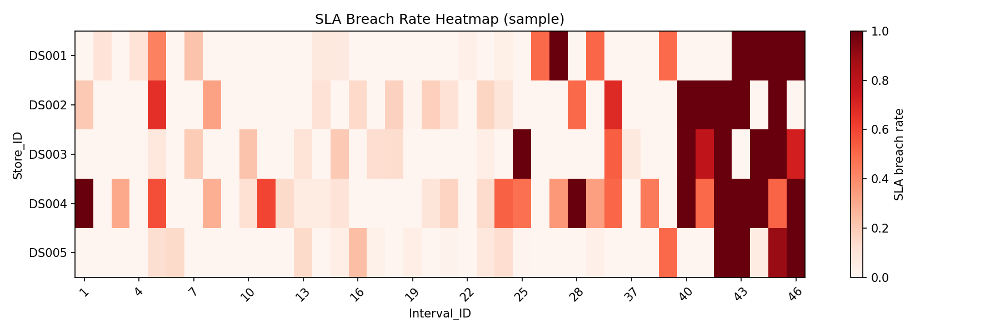
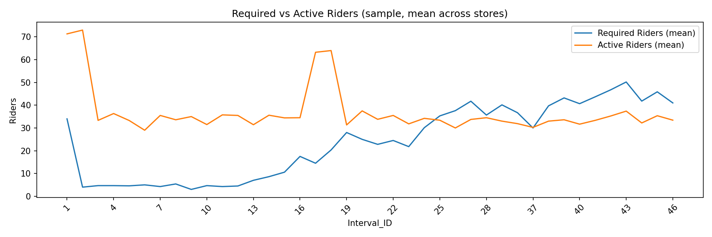
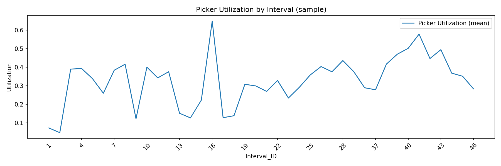
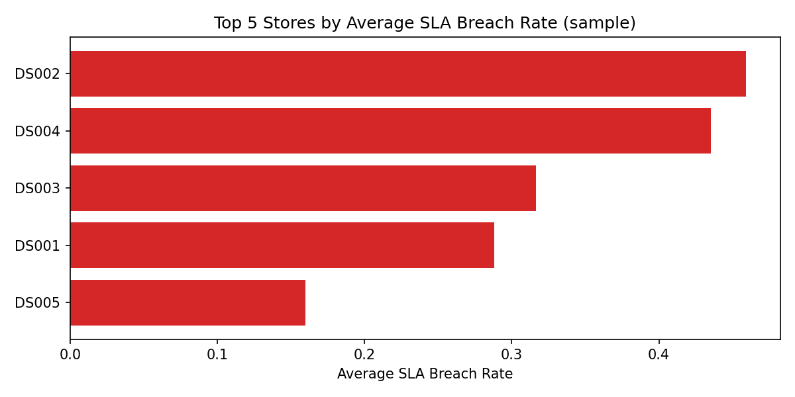
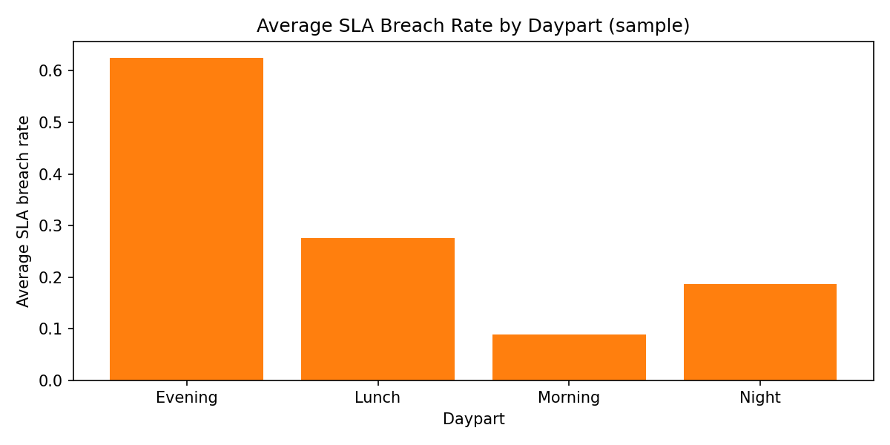
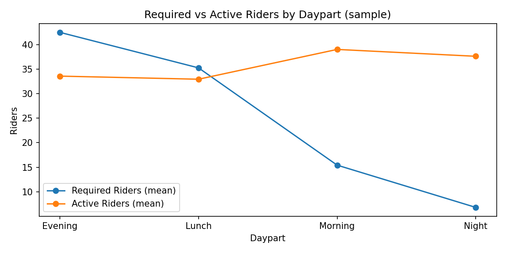
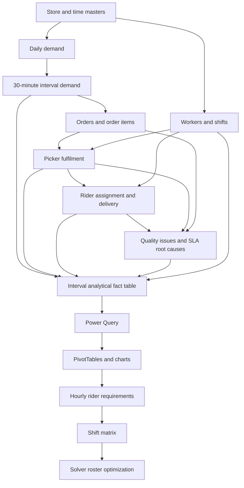
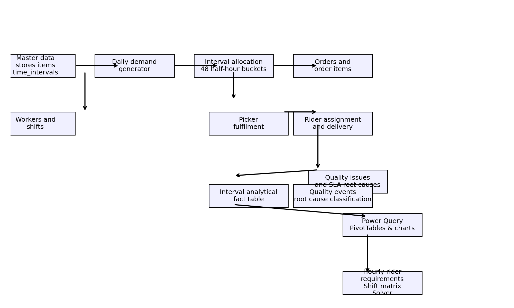

# Quick Commerce Operations — Simulated Operational Lifecycle

This repository contains a reproducible simulation and analytics pipeline that models core quick-commerce operations: in-store fulfilment (pickers), last-mile delivery (riders), order-level detail, quality issues, and interval-level operational analysis. The artifacts produced are intended to support dashboards, research, algorithm development (fleet sizing, rostering, route planning), and teaching about operational trade-offs in on-demand retail.

## Index

- [Run order (high level)](#run-order-high-level)
- [Purpose and audience](#purpose-and-audience)
- [Why this dataset is representative](#why-this-dataset-is-representative)
- [Reproducibility and determinism](#reproducibility-and-determinism)
- [Key generated artifacts (selected)](#key-generated-artifacts-selected)
- [Simulation methodology (high level)](#simulation-methodology-high-level)
- [Validation and data quality](#validation-and-data-quality)
- [Canonical fact: interval_operations_analysis.csv (fact_interval_operations)](#fact-interval-operations)
- [How the fact maps to dashboards (chart-by-chart guidance and ranking)](#how-the-fact-maps-to-dashboards)
- [Technical notes for building charts](#technical-notes-for-building-charts)
- [Dashboard layout recommendation](#dashboard-layout-recommendation)
- [Operational recommendations and how to use this dataset](#operational-recommendations)
- [Limitations and ethical considerations](#limitations-and-ethical-considerations)
- [How to run the pipeline](#how-to-run-the-pipeline)
- [Files to inspect for building dashboards](#files-to-inspect-for-building-dashboards)
- [Contributing and extension ideas](#contributing-and-extension-ideas)
- [Contact and citation](#contact-and-citation)
- [Files referenced in this README](#files-referenced-in-this-readme)

<a name="run-order-high-level"></a>
Run order (high level)
- **01_generate_master_data.py** — store master, time intervals, and basic validation.
- **02_generate_daily_demand.py** — calendar, weather, promotions, expected and realized daily orders.
- **03_generate_interval_demand.py** — split each store-day across 48 half-hour intervals.
- **04_generate_workers_and_shifts.py** — simulate pickers and riders, scheduled and actual attendance.
- **05_generate_orders_and_items.py** — generate skus, promotions, orders and order items (detail window for first 14 days).
- **06_generate_store_fulfilment.py** — assign pickers, produce pick timings and fulfilment events.
- **07_generate_last_mile_delivery.py** — assign riders, compute deliveries, SLA, cost, and rider performance.
- **08_generate_quality_and_root_causes.py** — generate item quality issues and classify SLA-breach root causes.
- **09_build_interval_operations_analysis.py** — combine everything into the canonical analytical fact table `interval_operations_analysis.csv` and produce recommended operational actions.

<a name="purpose-and-audience"></a>
Purpose and audience
- **Audience:** novice analysts, data scientists, operations researchers, and domain experts.
- **Purpose:** provide a complete, explainable, and auditable simulation of the operational lifecycle for quick commerce so researchers and practitioners can test policies (rostering, surge staffing, incentives), validate algorithms, or build dashboards that reflect realistic operational signals.

<a name="why-this-dataset-is-representative"></a>
Why this dataset is representative
- Layered construction: the simulation builds from master data (stores + time grid) through demand, interval allocation, workforce attendance, pick/pack events, and last-mile delivery. This mirrors the real operational flow from order creation to successful delivery.
- Explainability: each multiplier (day-of-week, weather, promotions, salary-week, noise) is explicit and parameterized for reproducibility and sensitivity analysis.
- Heterogeneity: store profiles, product categories, worker experience, and rider types (regular vs gig) produce variation representative of real operations.
- Validation built-in: each script runs a set of deterministic validation checks and fails early if assumptions are violated — this keeps the generated data trustworthy.

<a name="reproducibility-and-determinism"></a>
Reproducibility and determinism
- Every script uses a fixed random `SEED` and documents it at the top. Re-running scripts in sequence with the same seed reproduces identical outputs.
- All outputs are CSV files in `data/raw`, `data/processed`, and `data/validation` so downstream users can inspect and use them without re-running the full pipeline.

<a name="key-generated-artifacts-selected"></a>
Key generated artifacts (selected)
- `data/raw/stores.csv` — store list and baseline attributes.
- `data/raw/time_intervals.csv` — 48 half-hour intervals per day with `Interval_ID`, `Start_Time`, `Daypart`, `Default_Peak_Flag`.
- `data/raw/daily_store_demand.csv` — per store-date expected and actual daily orders with drivers (weather, promotions, salary week).
- `data/raw/interval_demand.csv` — 48 interval rows per store-date reconciling exactly to daily totals (multinomial draw).
- `data/raw/worker_shifts.csv` and `data/raw/workers.csv` — scheduled and attended workforce details (pickers, riders, gig vs regular).
- `data/raw/orders.csv`, `data/raw/order_items.csv` — order-level detail (detail window) and item lines used for fulfilment simulation.
- `data/raw/picker_interval_operations.csv` — interval-level picker allocations and capacity measurements.
- `data/raw/fulfilment_events.csv`, `data/raw/order_picker_assignments.csv` — pick timing and assignment events.
- `data/raw/delivery_events.csv`, `data/raw/order_rider_assignments.csv`, `data/raw/rider_shift_performance.csv` — last-mile events, assignment, and per-shift rider performance.
- `data/raw/quality_issues.csv`, `data/raw/sla_root_cause_analysis.csv` — synthetic quality failures and classified root causes for SLA breaches.
- `data/processed/interval_operations_analysis.csv` — the primary fact table (one row per store-date-interval) used to build dashboards and charts.

<a name="simulation-methodology-high-level"></a>
Simulation methodology (high level)
- Demand: daily expected orders are generated from a baseline `Base_Daily_Orders` multiplied by explicit factors: `Day_Of_Week_Factor`, `Salary_Week_Factor`, `Weather_Factor`, `Promotion_Factor`, and bounded random noise. Actual daily counts are sampled using a Poisson draw.
- Interval splitting: daily order totals are allocated across 48 half-hour buckets with a store-specific, weekend-aware demand curve. A multinomial draw assigns individual orders to intervals so interval-level totals exactly reconcile to daily totals.
- Workforce: headcounts are specified per store. Workers are assigned home shifts and scheduled; attendance (late, early, absent) is simulated with probabilities. Over-time short-OD shifts are added on surge days.
- Fulfilment: pick times are calculated per item using base seconds per unit adjusted by product complexity, picker experience, and congestion. A deterministic heap-based assignment simulates queueing and per-order pick sequencing.
- Last mile: riders are selected from attended rider shifts, travel times are estimated from distances and weather-modified speeds, and return availability is updated to model capacity. SLA estimates combine distance, load, peak, and weather.
- Quality and root causes: item-level probabilities for missing/wrong/damaged are computed from observable risk drivers (audit backlog, putaway backlog, fragile flag, congestion). SLA-breach root causes are ranked by which stage shows the largest excess delay.

<a name="validation-and-data-quality"></a>
Validation and data quality
- Each script includes a `validate_*` function which checks structural (uniqueness, foreign keys), volumetric (row counts), and behavioral (weekend > weekday demand; evening > night) expectations.
- If validations fail, scripts raise an exception and stop to prevent downstream contamination.
# Quick Commerce Operations — Simulated Operational Lifecycle

This repository provides a reproducible simulation and analytics pipeline that models core quick-commerce operations: store fulfilment (pickers), last-mile delivery (riders), order-level events, quality issues, and an interval-level analytical fact. Use this repo to build dashboards, explore operational trade-offs, and test rostering or fleet-sizing policies.

**Quick start (one-minute orientation)**
- **Run order:** execute scripts `01` → `09` in `scripts/` (see `How to run` below).
- **Primary artifact:** `data/processed/interval_operations_analysis.csv` — a canonical fact table at the store × date × half-hour interval grain.
- **Onboarding:** open `notebooks/quick_exploration.ipynb` and `data/sample/interval_operations_sample.csv` for a fast, dependency-light tour.

**What this repo contains (short)**
- **Simulation scripts:** `scripts/01_generate_master_data.py` … `scripts/09_build_interval_operations_analysis.py`
- **Raw outputs:** `data/raw/` — event-level CSVs used to build the fact
- **Processed fact:** `data/processed/interval_operations_analysis.csv`
- **Sample for onboarding:** `data/sample/interval_operations_sample.csv` and `data/sample/README.md`
- **Notebook:** `notebooks/quick_exploration.ipynb` — example analyses and charts

**Learning path (how we’ll teach this project)**
Follow this order when reviewing the project; each step builds on the previous and we'll walk through formulas, joins, and the Solver walkthrough when you are ready:

1. **Business objective:** what SLA and service trade-offs we model
2. **Master data:** stores, time intervals, and store attributes
3. **Daily demand:** how daily orders are generated and drivers
4. **Interval allocation:** splitting daily demand into 48 half-hour buckets
5. **Workforce model:** shifts, attendance, pickers, and riders
6. **Fulfilment & last-mile:** pick sequencing and rider assignment
7. **Quality & root causes:** synthetic item-level quality failures
8. **Build fact:** `interval_operations_analysis.csv` — joins and keys
9. **Dashboards & charts:** heatmaps, utilization, and cost analysis
10. **Rostering & Solver:** how shift matrices and Solver reduce excess capacity
11. **Validation & sensitivity:** tests, parameter sweeps, and scenario analysis
12. **Operational playbook:** recommended actions and how to apply them

---

**Primary files to inspect (fast links)**
- `scripts/01_generate_master_data.py` … `scripts/09_build_interval_operations_analysis.py` — pipeline scripts
- `data/processed/interval_operations_analysis.csv` — canonical fact
- `data/sample/interval_operations_sample.csv` — representative sample for onboarding
- `notebooks/quick_exploration.ipynb` — exploration notebook

**How to run (developer quickstart)**
1. Create and activate a venv and install dependencies (recommended):

```bash
python3 -m venv .venv
source .venv/bin/activate
pip install -r requirements.txt  # or pip install pandas numpy matplotlib
```

2. Run scripts in order from the project root:

```bash
python3 scripts/01_generate_master_data.py
python3 scripts/02_generate_daily_demand.py
...
python3 scripts/09_build_interval_operations_analysis.py
```

---

**Canonical fact: structure & key fields**
The canonical fact `interval_operations_analysis.csv` (produced by `scripts/09_build_interval_operations_analysis.py`) is at the store × date × half-hour interval grain and contains fields such as:

- **keys:** `Store_Date_Interval_ID`, `Store_ID`, `Date`, `Interval_ID`, `Daypart`
- **picker capacity:** `Active_Pickers`, `Picker_Utilization`, `Required_Pickers_At_Target`, `Picker_Supply_Gap`
- **rider supply:** `Active_Riders`, `Rider_Utilization`, `Required_Riders_At_Target`, `Rider_Supply_Gap`, `Rider_Cost_INR`
- **service KPIs:** `Orders`, `Units`, `Revenue_INR`, `SLA_Breaches`, `SLA_Breach_Rate`, `Average_Total_Delivery_Min`
- **quality signals:** `Quality_Issue_Count`, `Missing_Item_Count`, `Wrong_Item_Count`, `Quality_Financial_Impact_INR`
- **diagnostics:** `Dominant_Root_Cause`, `Recommended_Action`

Keep `Store_Date_Interval_ID` as the primary key for joins and aggregations.

---

**Recommended charts and interpretation (prioritized)**
- **SLA Breach Heatmap (Top):** pivot `SLA_Breach_Rate` by `Store_ID` × `Interval_ID` to spot hotspots.
- **Required vs Active Riders/Pickers:** line charts compare `Required_*` vs `Active_*` to reveal supply gaps.
- **Utilization vs Cost:** scatter plots of `Rider_Utilization` vs `Rider_Cost_Per_Order_INR` to spot inefficiencies.
- **Picker queue & picking time:** time-series of `Average_Pick_Queue_Min` and `Average_Picking_Min` to find internal bottlenecks.
- **Root-cause distribution:** stacked bars/treemap of `Dominant_Root_Cause` to prioritize interventions.

Practical tips: prefer 3–7 day rolling averages for KPIs and flag intervals with `SLA_Breach_Rate > 0.15` plus a negative supply gap.

---

**Images and figures**
The repo contains a set of sample charts used for onboarding (in `docs/images/`). These are embedded below and are intended as examples; replace them with exported charts from your workbook if needed.

- Figure: SLA breach heatmap — `docs/images/fig-sla-heatmap.png`
- Figure: Required vs Active Riders — `docs/images/fig-required-vs-active-riders.png`
- Figure: Picker Utilization by interval — `docs/images/fig-picker-utilization.png`
- Figure: Top stores by SLA — `docs/images/fig-top-stores-sla.png`
- Figure: Daypart SLA — `docs/images/fig-daypart-sla.png`
- Figure: Daypart riders — `docs/images/fig-daypart-required-vs-active.png`

(These images are generated by `scripts/generate_sample_charts.py`.)

---

**Figures (image + explanation)**



**What to read here:** This heatmap shows `SLA_Breach_Rate` with stores on the Y axis and half-hour `Interval_ID` on the X axis. Look for persistent horizontal bands (stores with systemic issues) and vertical bands (network-wide problem at specific intervals). Use this to prioritize stores and intervals for immediate action.



**What to read here:** Mean `Required_Riders_At_Target` versus mean `Active_Riders` across intervals. Gaps where the required line is above the active line indicate rider shortages; sustained gaps across peak intervals are high-priority for rostering or incentives.



**What to read here:** Average picker utilization by interval. Spikes show intense pick pressure; rising utilization followed by increasing pick-queue times (inspect `Average_Pick_Queue_Min`) implies store-level fulfilment bottlenecks.



**What to read here:** Ranked stores by average SLA breach rate (sample). Use this list for tactical interventions (retraining, temporary rider allocation, or deeper quality investigations).



**What to read here:** Average SLA breach rate aggregated by `Daypart` (morning, lunch, evening, night). Use daypart-level findings to test redistributing shifts or incentives to specific windows.



**What to read here:** Required vs Active riders aggregated by `Daypart`. This view shows whether supply mismatches are concentrated in particular dayparts and helps focus short-duration OD shifts.

---

**Data pipeline architecture**


Below is a high-level architecture diagram of the pipeline (master → demand → intervals → workforce → fulfilment → last-mile → quality → build fact → dashboards). Rendered as a Mermaid flowchart so you can visualize joins and data movement at a glance.



This diagram maps directly to the scripts `scripts/01_*` → `scripts/09_*`. Each arrow represents CSV outputs read by the next stage. Use the diagram during walkthroughs to keep the join keys and grain explicit.

If your environment (Safari or other viewers) cannot render Mermaid, a PNG fallback is available below:



**Pipeline joins: keys and examples**

Below are the main joins between stages, the typical join keys, and short SQL and pandas examples showing how the joins are performed. Use these examples during walkthroughs to reproduce the fact table construction and to validate joins.

1) Master → Daily demand
- Keys: `Store_ID`
- SQL example:

```sql
SELECT d.*, s.store_name
FROM data_raw.daily_store_demand d
JOIN data_raw.stores s ON d.Store_ID = s.Store_ID;
```

- pandas example:

```python
import pandas as pd
stores = pd.read_csv('data/raw/stores.csv')
demand = pd.read_csv('data/raw/daily_store_demand.csv')
df = demand.merge(stores, on='Store_ID', how='left')
```

2) Daily demand → Interval allocation
- Keys: `Store_ID`, `Date` (interval allocation ensures sums match daily totals)
- SQL example:

```sql
SELECT ia.*, d.total_orders
FROM data_raw.interval_demand ia
JOIN data_raw.daily_store_demand d
  ON ia.Store_ID = d.Store_ID AND ia.Date = d.Date;
```

3) Interval allocation → Orders & order_items
- Keys: `Store_ID`, `Date`, `Interval_ID`
- pandas example:

```python
orders = pd.read_csv('data/raw/orders.csv')
intervals = pd.read_csv('data/raw/interval_demand.csv')
# orders already have Interval_ID assigned in simulation; join for enrichment
orders = orders.merge(intervals[['Store_ID','Date','Interval_ID']], on=['Store_ID','Date','Interval_ID'], how='left')
```

4) Orders → Store fulfilment (picker assignments)
- Keys: `Order_ID` → enrich with picker events via `order_picker_assignments` and `fulfilment_events`

```sql
SELECT o.Order_ID, pa.Picker_ID, fe.pick_start_min, fe.pick_end_min
FROM data_raw.orders o
LEFT JOIN data_raw.order_picker_assignments pa ON o.Order_ID = pa.Order_ID
LEFT JOIN data_raw.fulfilment_events fe ON pa.assignment_id = fe.assignment_id;
```

5) Fulfilment → Last-mile (rider assignment)
- Keys: `Order_ID` → `order_rider_assignments`, use `Store_ID` + `Interval_ID` for interval aggregation

```python
riders = pd.read_csv('data/raw/order_rider_assignments.csv')
deliveries = pd.read_csv('data/raw/delivery_events.csv')
orders = orders.merge(riders, on='Order_ID', how='left').merge(deliveries, on='Order_ID', how='left')
```

6) Fulfilment & Last-mile → Interval aggregation (build fact)
- Keys: `Store_ID`, `Date`, `Interval_ID` (group-by aggregation produces counts, averages, and diagnostics)

```sql
SELECT Store_ID, Date, Interval_ID,
  COUNT(DISTINCT Order_ID) AS Orders,
  AVG(Rider_Utilization) AS Rider_Utilization,
  SUM(SLA_Breach_Flag) AS SLA_Breaches
FROM combined_events
GROUP BY Store_ID, Date, Interval_ID;
```

7) Quality events → Augment fact
- Keys: `Order_ID`, `Store_ID`, `Date`, `Interval_ID` (map quality issues back to interval rows)

```python
quality = pd.read_csv('data/raw/quality_issues.csv')
qagg = quality.groupby(['Store_ID','Date','Interval_ID']).agg({'issue_id':'count'}).rename(columns={'issue_id':'Quality_Issue_Count'})
fact = fact.merge(qagg, on=['Store_ID','Date','Interval_ID'], how='left')
```

These examples are intentionally short. Below are representative column-level join lists (typical columns observed in this repo) and validation checks you can run to ensure joins are correct.

**Column-level join lists (representative)**
- `data/raw/stores.csv`: `Store_ID`, `store_name`, `latitude`, `longitude`, `city`, `store_type`, `Base_Daily_Orders`
- `data/raw/time_intervals.csv`: `Interval_ID`, `Start_Time`, `End_Time`, `Daypart`, `Default_Peak_Flag`
- `data/raw/daily_store_demand.csv`: `Store_ID`, `Date`, `Expected_Daily_Orders`, `Actual_Daily_Orders`, `Promotion_Flag`, `Weather_Risk`
- `data/raw/interval_demand.csv`: `Store_ID`, `Date`, `Interval_ID`, `Interval_Orders`, `Interval_Share`
- `data/raw/orders.csv`: `Order_ID`, `Store_ID`, `Date`, `Interval_ID`, `Created_At`, `Total_Items`, `Order_Value_INR`
- `data/raw/order_items.csv`: `Order_Item_ID`, `Order_ID`, `SKU`, `Quantity`, `Unit_Price_INR`
- `data/raw/order_picker_assignments.csv`: `assignment_id`, `Order_ID`, `Picker_ID`, `Assigned_At`
- `data/raw/fulfilment_events.csv`: `event_id`, `assignment_id`, `pick_start_min`, `pick_end_min`, `pick_duration_min`
- `data/raw/order_rider_assignments.csv`: `assignment_id`, `Order_ID`, `Rider_ID`, `Assigned_At`
- `data/raw/delivery_events.csv`: `delivery_id`, `Order_ID`, `pickup_time`, `delivery_time`, `total_delivery_min`, `rider_distance_km`
- `data/raw/quality_issues.csv`: `issue_id`, `Order_ID`, `Store_ID`, `Date`, `Interval_ID`, `issue_type`, `severity`
- `data/processed/interval_operations_analysis.csv` (fact): `Store_Date_Interval_ID`, `Store_ID`, `Date`, `Interval_ID`, `Daypart`, `Orders`, `Units`, `Active_Pickers`, `Required_Pickers_At_Target`, `Active_Riders`, `Required_Riders_At_Target`, `SLA_Breaches`, `Average_Total_Delivery_Min`, `Quality_Issue_Count`, `Dominant_Root_Cause`

**Validation checks (quick SQL and pandas snippets)**

- 1) Foreign-key completeness: every `Store_ID` in `daily_store_demand` must exist in `stores`.

SQL:
```sql
SELECT COUNT(*) AS missing_stores
FROM data_raw.daily_store_demand d
LEFT JOIN data_raw.stores s ON d.Store_ID = s.Store_ID
WHERE s.Store_ID IS NULL;
```

pandas:
```python
stores = pd.read_csv('data/raw/stores.csv')
demand = pd.read_csv('data/raw/daily_store_demand.csv')
missing = demand[~demand.Store_ID.isin(stores.Store_ID)]
len(missing)
```

- 2) Interval-to-daily reconciliation: per `Store_ID` × `Date`, sum(`Interval_Orders`) == `Actual_Daily_Orders`.

SQL:
```sql
SELECT d.Store_ID, d.Date,
	d.Actual_Daily_Orders,
	SUM(i.Interval_Orders) AS interval_sum
FROM data_raw.daily_store_demand d
JOIN data_raw.interval_demand i ON d.Store_ID = i.Store_ID AND d.Date = i.Date
GROUP BY d.Store_ID, d.Date
HAVING d.Actual_Daily_Orders <> SUM(i.Interval_Orders);
```

pandas:
```python
ia = pd.read_csv('data/raw/interval_demand.csv')
dd = pd.read_csv('data/raw/daily_store_demand.csv')
agg = ia.groupby(['Store_ID','Date']).Interval_Orders.sum().reset_index().rename(columns={'Interval_Orders':'interval_sum'})
check = dd.merge(agg, on=['Store_ID','Date'], how='left')
check[check.Actual_Daily_Orders != check.interval_sum]
```

- 3) Non-null join keys on fact: ensure `Store_ID`, `Date`, `Interval_ID` are present on every fact row.

SQL:
```sql
SELECT COUNT(*) FROM data_processed.interval_operations_analysis WHERE Store_ID IS NULL OR Date IS NULL OR Interval_ID IS NULL;
```

pandas:
```python
fact = pd.read_csv('data/processed/interval_operations_analysis.csv')
fact[fact[['Store_ID','Date','Interval_ID']].isnull().any(axis=1)]
```

- 4) Row-count sanity: number of fact rows should equal (#stores × #dates × 48) for a complete run (or fewer if trimmed).

```python
stores = pd.read_csv('data/raw/stores.csv')
intervals = 48
dates = fact.Date.nunique()
expected = len(stores) * dates * intervals
len(fact), expected
```

- 5) SLA aggregation validation: sum of per-order SLA breach flags aggregated to interval should equal `SLA_Breaches` in the fact.

```sql
SELECT f.Store_ID, f.Date, f.Interval_ID, f.SLA_Breaches,
	SUM(o.sla_breach_flag) AS order_breaches
FROM data_processed.interval_operations_analysis f
JOIN data_raw.orders o ON f.Store_ID = o.Store_ID AND f.Date = o.Date AND f.Interval_ID = o.Interval_ID
GROUP BY f.Store_ID, f.Date, f.Interval_ID
HAVING f.SLA_Breaches <> SUM(o.sla_breach_flag);
```

These validation checks are a good starting point; during the final walkthrough I can add CI-style assertions (pytest or simple `scripts/validate_fact.py`) that raise errors when checks fail. If you want, I'll add `scripts/validate_fact.py` that runs the pandas checks and returns non-zero exit codes for CI.


---

**Simulation methodology (brief)**
- **Demand:** baseline orders multiplied by explicit factors (day-of-week, weather, promotions, salary-week) and sampled via Poisson draws.
- **Interval split:** store-specific multinomial allocation to 48 half-hour buckets so interval totals reconcile to daily totals.
- **Workforce:** scheduled shifts, attendance probabilities, and short OD shifts for surge.
- **Fulfilment:** item-level pick-time model adjusted for product complexity and congestion; deterministic assignment simulates queues.
- **Last-mile:** rider assignment with distance/speed estimates and weather adjustments; SLA combines distance, load and congestion.
- **Quality:** item-level risk model produces missing/wrong/damaged counts and classifies dominant root causes.

---

**Validation & reproducibility**
- Every script includes `validate_*` checks (structural, volumetric, behavioral). Failing validations raise exceptions to avoid contaminating downstream data.
- All scripts use a documented random `SEED` for determinism; outputs are CSVs in `data/` for auditability.

---

**Operational findings (quick summary)**
- **Key achievement so far:** the roster redesign reduced scheduled rider-hours from **4,090** to **3,978** while preserving coverage — a 112 rider-hour reduction (~2.7%).
- **Management lesson:** headcount optimization without aligning shift boundaries yields excess capacity; shift redesign can cut excess without losing coverage.

---

**Files & next steps**
- `scripts/generate_sample_charts.py` — regenerates onboarding PNGs in `docs/images/` from the sample CSV.
- `data/sample/README.md` — explains how the sample was created (reservoir sampling) and its provenance.

If you'd like, I will:
- regenerate alternate aggregates (rolling-window heatmaps, store-level trends), or
- produce a polished PDF presenation of the findings for reviewers.

---

**Contact & citation**
If you publish analyses based on this simulation, please cite the repository and include parameter choices (seed, modified assumptions) so others can reproduce your work.

